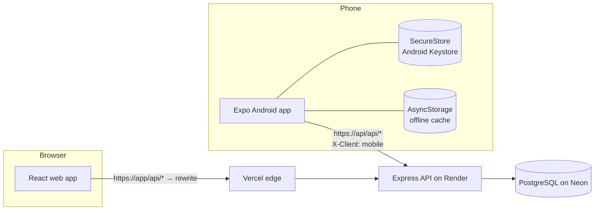
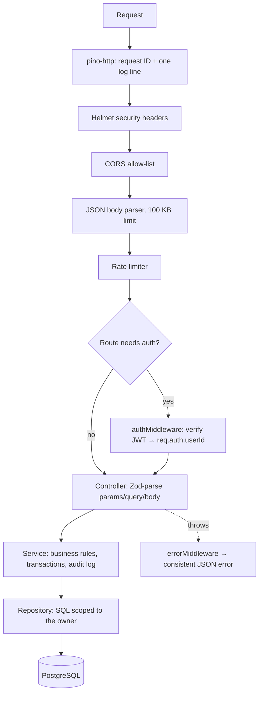
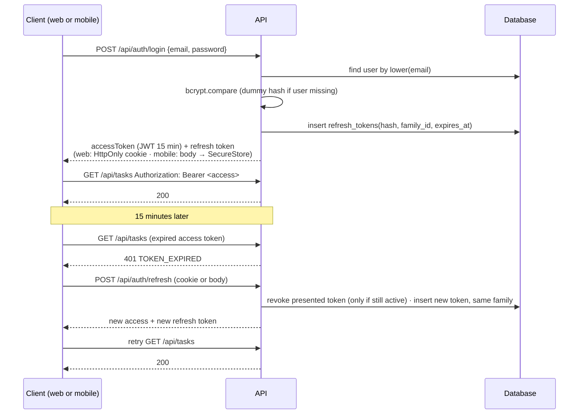

# Architecture

## System overview



One API serves both clients. They call identical endpoints; the API distinguishes them only to decide how the refresh token is delivered (cookie for browsers, JSON body for the phone, which has no cookie jar).

## Monorepo

npm workspaces, no extra build tool:

| Workspace | Role |
|---|---|
| `packages/shared` | Zod schemas, enums, API types, date helpers. Compiled to ESM in `dist/`; built first. |
| `apps/api` | Express 5 API, Drizzle ORM, SQL migrations, integration tests |
| `apps/web` | React 19 + Vite SPA |
| `apps/mobile` | Expo SDK 57 app with Expo Router |

Why a shared package: the same rule (e.g. "end date cannot be before start date", "password needs a letter and a number") is validated in the API for security and in both forms for UX. Writing it once removes the classic drift where the form accepts something the API rejects.

## API request pipeline



| Layer | Folder | Responsibility | Example |
|---|---|---|---|
| Routes | `src/routes` | Path → middleware → controller. No logic. | `tasks.patch('/:id', taskController.patch)` |
| Controllers | `src/controllers` | Parse untrusted input with Zod, call a service, send the response. | `parse(patchTaskSchema, req.body)` |
| Services | `src/services` | Business rules and transactions. | Set `completedAt` when a task becomes COMPLETED; verify the target project is yours before moving a task. |
| Repositories | `src/repositories` | Every SQL query. Every query takes `userId`. | `update tasks … where id = $1 and project_id in (select id from projects where user_id = $2)` |
| Middleware | `src/middleware` | Auth, errors, rate limits, logging, CSRF origin check | |
| Validators | `packages/shared/src/schemas` | Zod schemas, shared with the clients | |

Express 5 forwards rejected promises from async handlers to the error middleware, so controllers have no try/catch boilerplate.

### Error contract

```json
{ "success": false, "error": { "code": "VALIDATION_ERROR", "message": "Request validation failed",
  "details": [{ "path": "endDate", "message": "End date cannot be before the start date" }], "requestId": "…" } }
```

| Status | Code(s) | When |
|---|---|---|
| 400 | `VALIDATION_ERROR` | Invalid body, query or path parameter; malformed JSON |
| 401 | `UNAUTHENTICATED`, `INVALID_TOKEN`, `TOKEN_EXPIRED`, `INVALID_CREDENTIALS`, `REFRESH_TOKEN_INVALID`, `REFRESH_TOKEN_REUSED` | Authentication problems |
| 403 | `FORBIDDEN` | Cookie request from an untrusted origin (CSRF) |
| 404 | `NOT_FOUND` | Missing resource **or another user's resource** |
| 409 | `EMAIL_TAKEN`, `REFRESH_CONFLICT` | Duplicate email; concurrent refresh (retry once) |
| 413 | `PAYLOAD_TOO_LARGE` | Body over 100 KB |
| 429 | `RATE_LIMITED` | Too many requests |
| 500 | `INTERNAL_ERROR` | Anything unexpected — logged with stack and request ID, generic message to the client |

The web and mobile clients map `details[].path` back onto form fields, so server-side validation errors appear next to the right input.

## Authentication flow



**Rotation and reuse detection.** Every refresh revokes the presented token and issues a new one in the same *family* (one family per login). If a token that was already rotated is presented again more than 30 seconds later, it must be a copy, so the API revokes the entire family: both the attacker and the real user are signed out and must log in again. Within 30 seconds the API answers `409 REFRESH_CONFLICT` instead; this covers two browser tabs refreshing at the same moment, and the client simply retries once.

**Single-flight refresh.** Both clients share one in-flight refresh promise. When five requests fail with 401 at once, one refresh happens and all five are retried.

**Session expiry UX.** When refresh fails with 401 (token expired, revoked, or "signed out everywhere"), the client clears its session — on Android it wipes SecureStore and the offline cache — and shows the login screen with "Your session has expired. Please log in again." A refresh failing with 429 or 5xx, or a network error, does not log the user out.

**Why a cookie on the web?** An HttpOnly cookie cannot be read by JavaScript, so an XSS bug cannot steal the long-lived token. The short-lived access token lives only in memory. The cookie is scoped to `path=/api/auth`, so it is not even sent with ordinary API calls, and those carry the Bearer header and are not exposed to CSRF. The two cookie endpoints (`/refresh`, `/logout`) also check the `Origin` header.

**Why SecureStore on Android?** Expo SecureStore encrypts values with a key held in the Android Keystore. AsyncStorage is an unencrypted file, so it is used only for the non-secret offline cache of tasks, which is also wiped on logout.

## Cross-platform synchronisation

There is no sync engine: both apps read and write the same rows through the same API. Freshness is handled by TanStack Query on both clients:

- After any mutation, the affected query keys (`tasks`, `projects`, `project`, `dashboard`) are invalidated and refetched.
- **Web:** queries refetch when the browser tab regains focus, so switching back from the phone updates the page without a manual refresh.
- **Android:** pull-to-refresh refetches the screen's queries; returning the app to the foreground (AppState) also refetches stale queries.

## Mobile app structure

```
app/
  _layout.tsx            providers + Stack.Protected guards (signed-in vs signed-out routes), splash screen
  login.tsx, register.tsx
  (app)/_layout.tsx      stack for detail screens
  (app)/(tabs)/          Dashboard · Projects · Tasks · Settings (bottom tabs)
  (app)/projects/[id].tsx   project detail + its tasks
  (app)/projects/form.tsx   create / edit a project (modal)
  (app)/tasks/[id].tsx   status/priority chips (PATCH immediately), complete, delete
  (app)/tasks/form.tsx   create / edit (modal)
src/lib/                 api client (SecureStore), auth context, TanStack Query setup + persistence
src/components/          UI primitives, rows, empty/error/offline states
```

**Offline behaviour.** NetInfo feeds TanStack Query's `onlineManager`. Offline, queries pause and the screens keep showing persisted data under a "No internet connection — showing saved data" banner. If nothing is cached, a "No internet connection" state with Retry is shown, never a blank screen. Mutations fail immediately with a native alert instead of queueing silently.

## Web app structure

```
src/
  auth/      AuthProvider (session restore via refresh cookie), route guards
  lib/       api client, TanStack Query hooks, query client
  layouts/   AppLayout — sidebar on desktop, drawer below 1024 px
  pages/     Dashboard, Projects, ProjectDetail, Tasks, Settings, Login/Register, 404
  components/ui  Button, Field, Dialog (native <dialog>), ConfirmDialog, Toast, Pagination, states
```

Signed-in pages are code-split. Project list filters live in the URL, so reloads and the back button keep them. Below 1280 px, tables collapse into stacked rows rather than squeezing columns.

## Theming (light / dark / system)

Both clients use the same colour tokens with a light and a dark value, chosen in Settings (Light, Dark or System).

- **Web:** tokens are CSS custom properties (`index.css`). `data-theme="dark"` on `<html>` swaps every value, so no component needs dark-specific classes. An inline script in `index.html` applies the saved choice before the first paint (no white flash). The choice is stored in `localStorage`; "System" follows `prefers-color-scheme` live. `theme.test.ts` checks every text/background pair against WCAG AA (4.5:1) in both themes.
- **Android:** `ThemeProvider` (`src/lib/theme-context.tsx`) loads the saved choice from AsyncStorage while the splash screen is still up, then provides the palette. Screens use `makeStyles((colors, text) => …)`, which builds each stylesheet once per theme. React Navigation, the status bar, native dialogs (`Appearance.setColorScheme`) and the pull-to-refresh spinner follow the theme too. The preference is a UI setting, so it survives logout.
